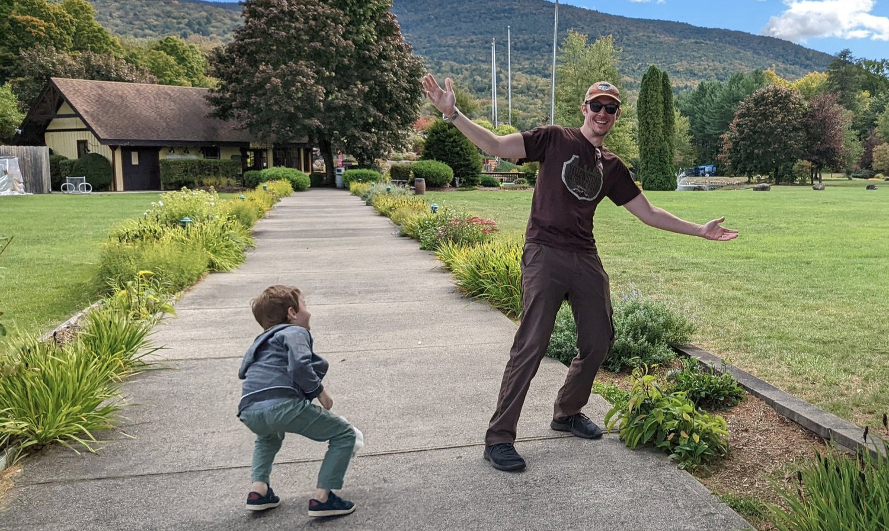



When my application to the Rhode Island School of Design was rejected, I pivoted
to the thing I'd been doing for fun and hadn't thought of as a career: writing
code.
I joined an educational startup, stayed through five years of turbulence, and
found my footing in an industry I hadn't planned on.

Along the way, I co-founded a photography instruction business with a close
friend and taught on-location workshops across the country. We had to close when
the 2008 financial crisis hit, but what stayed with me wasn't the loss of the
business, it was the discovery that teaching people to see differently was one
of the most satisfying things I had ever done.

That discovery sat in the background for years while I worked my way through
each layer of a software career, from engineer to tech lead to manager to
director. As the roles grew larger and more complex, the nature of the work
shifted. The problems I spent my time on were less and less about code and more
and more about how people communicate, make decisions under pressure, and find
their footing when the terrain feels unfamiliar.

The specific moment of recognition came when I read [The Coaching
Habit](https://amzn.to/3cFD0Qf) by Michael Bungay Stanier. Reading it, I
understood at once that coaching was a real discipline with real techniques, and
that I had been attempting it for years without knowing what it was or doing it
particularly well. That realization sent me to formal coaching training, to more
books, and eventually to building a practice around the work I had already been
doing by instinct.

When I'm not coaching, you'll find me with my son, out with my camera, or flying
my drone.

Start the conversation
