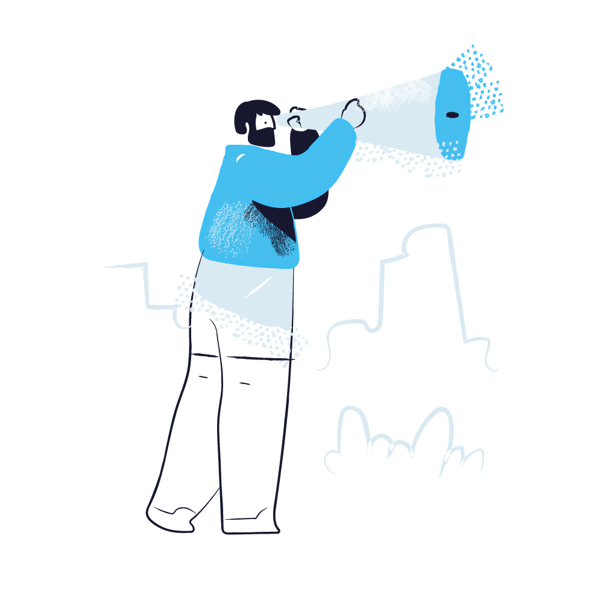



## Create clarity in one hour

Not every hard moment calls for a long-term engagement. Sometimes what you need
is a single, focused conversation: a thinking partner for the one decision, the
one conversation, the one fork in the road that's currently eating your
attention.

Clear the Fog is a single one-hour coaching session built for exactly that
moment. We'll take whatever is unclear to you right now, whether it's a decision
you can't quite see the shape of, a conversation you're dreading, or a choice
you keep circling without landing on, and work it until it resolves into
something you can act on. You'll leave with more clarity than you came in with,
and a clear next step.

This is not a pitch for a longer engagement. If you need more support after this
hour, we can talk about the ways I could help, but this is a self-contained hour
of partnership for whatever is in front of you right now.

**Please note:** I have only one Clear the Fog session slot available per week,
so if you need something consistent and guaranteed, this may not be the best
option for you.

  

    $300
    $197
  

  
Enjoy 35% off until I change my mind.

  Book Your Session



## What to expect

A single 60-minute video call (I use Google Meet), scheduled at a time that
works for you. Come with whatever is unclear, half-formed, or stuck. You don't
need to have it organized before we talk; that's what the hour is for.



## Is this the right fit?

Clear the Fog works best when you have one specific thing weighing on you, not a
general sense that things are hard. If what you're carrying is bigger than a
single moment, an ongoing pattern, a long-term transition, or a role that
consistently feels too big, a longer engagement will serve you
better. [Learn more about working together](/get-started).
