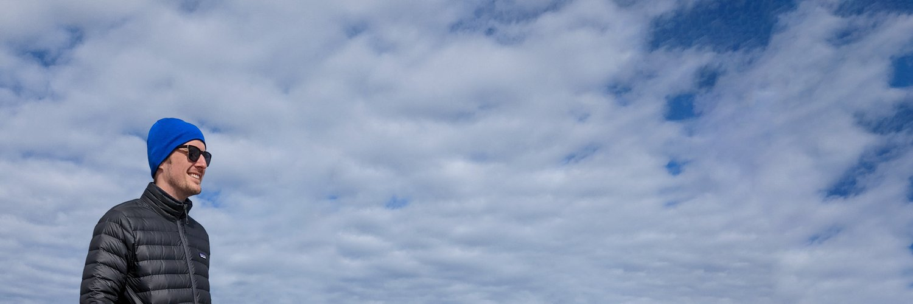

 



## Let's transform the technology industry

Coaching is an ongoing, transformative process. In each session, we convert your
immediate, pressing challenges into compounding resilience. My mission is to
expand your impact, creating a durable, sustainable, humane culture for your
team and your company.

I work with curious, empathetic, open-minded, high-performing leaders. I do not
help people chase their OKRs, burden their teams with process, achieve promotion
for its own sake, or manage the appearance of effectiveness.

I do help leaders create sustainable leverage through transparency, diversity,
continuous feedback, experimentation, and deep personal reflection.



## Ready to get started? Let's talk.






Aaron coached me with candor when I first became a manager, ultimately leading to my promotion to senior manager.


