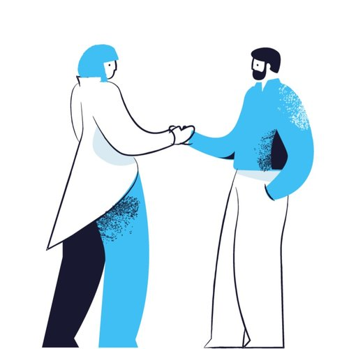



# This is no time for a shitty resume. {.center}



 

How well does your resume or LinkedIn profile reflect the value you bring into
your work? Does it stand out from the hundreds of other applicant profiles a
recruiter sees every day? Based on your resume alone, why would someone want to
hire you?

A great resume tells a story about where you've come from, what you can do, and
why hiring you is going to be the best decision any company could make.

I'll help you showcase yourself authentically, drawing on my two decades of
experience in the tech industry, my work in coaching and interviewing engineers,
and my long-practiced writing skills.




Thank you so much for your guidance. You definitely helped me to improve my job search.








Which of these sounds better to you?

* Took on role as tech lead/scrum master, doubled sprint velocity, managed
  project plans/comms.

Or:

* Took responsibility for the end-to-end software development lifecycle,
  resulting in a permanent 200% increase in sprint team velocity. Recognized by
  stakeholders for improved transparency and predictability of project outcomes.

They both present roughly the same facts, but which one would you rather share
with the recruiters and hiring managers you’re talking to?





## You will receive:



 

#### One-on-one consultation

The key to a great resume is that it presents exactly what it needs to, and
nothing that it doesn’t.

This starts with a one-on-one consultation so that I can understand your story
and your goals.



 

#### LinkedIn & resume review

Based on our conversation, I’ll provide personalized guidance on where your
existing profile and resume are falling short and what you can do to close the
gaps and highlight your unique strengths.



 

#### Proofing & copy editing

Writing not your strong suit? No problem! You’ll get one pass of proofing and
copy editing to be sure your profile is grammatically correct and has a presence
that reflects your own personality.





You'll receive all of the above, and email access to me for questions and
guidance, for $149.

<link href="https://assets.calendly.com/assets/external/widget.css" rel="stylesheet">

    <a href="" class="button-medium" onclick="Calendly.initPopupWidget({url: 'https://calendly.com/aaron-bieber/resume-consultation'});return false;">Book your consultation</a>


